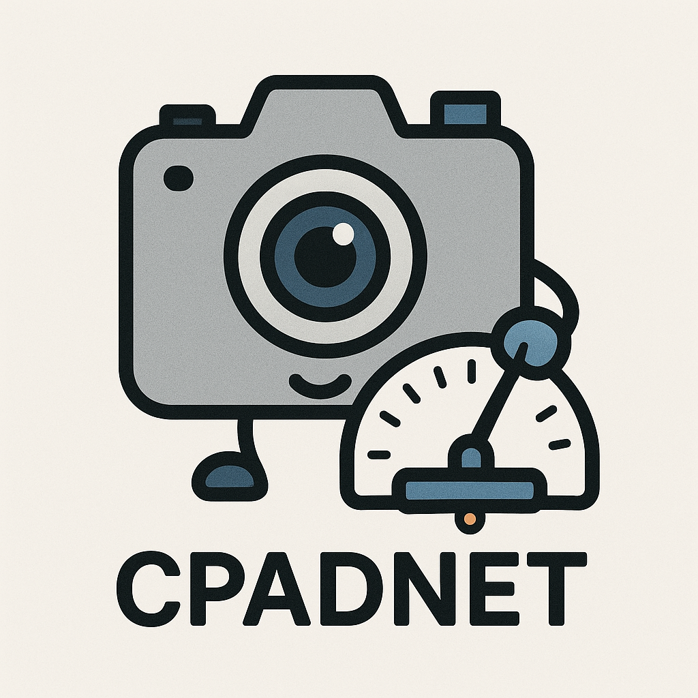

# CPADNet: Camera Parameter-Adaptive Denoising Network
## [ICIP2025] Towards Controllable Real Image Denoising with Camera Parameters

[2025.07] Code and pretrained models will be released soon.  
[2025.09.24] Initial release.  
[To do] **1st place in ICCV AIM 2025 Challenge for Low-light RAW Video Denoising**, using our idea.  
We are currently cleaning up the codes for additional release.

<div align="center">
  
<p align="center">  </p>

###### Logo image generated by ChatGPT (OpenAI GPT-4o)

[](https://www.arxiv.org/abs/2507.01587)
[](https://ieeexplore.ieee.org/document/11084351)

</div>

## 📖Abstract
Recent deep learning-based image denoising methods have shown impressive performance; however, many lack the flexibility to adjust the denoising strength based on the noise levels, camera settings, and user preferences. In this paper, we introduce a new controllable denoising framework that adaptively removes noise from images by utilizing information from camera parameters. Specifically, we focus on ISO, shutter speed, and F-number, which are closely related to noise levels. We convert these selected parameters into a vector to control and enhance the performance of the denoising network. Experimental results show that our method seamlessly adds controllability to standard denoising neural networks and improves their performance.

## 🍀Environment
* Ubuntu 22.04.05
* Python 3.7.16
* PyTorch 1.13.1+cu117
* TensorFlow 2.11.0
* CUDA 11.7

## 📈Dataset
To get started, download SID and SIDD datasets from the official repositories according to their description.

* [SID](https://github.com/cchen156/Learning-to-See-in-the-Dark)
* [SIDD](https://abdokamel.github.io/sidd/)

For SID dataset, we postprocess the ARW files using the `postprocess` function of `rawpy` with default arguments.  
For SIDD dataset, the full-resolution benchmark dataset is utilized for visual evaluation.   

For evaluation, place the datasets under `/datasets/SID/` and `/datasets/SIDD/` referring to the codes in `/data`.

## 🦾Pretrained Models

Pretrained models are released in this repository under `/pretrained_models`. 

## 🤖Inference

Run `eval_SID.py` or `eval_SIDD.py` for evaluation. 

* Change the `--exp_name` argument to test different models.
* To test the controllability of the denoising networks, adjust the input camera parameters in the evaluation codes.

## 🫶Citation
If you found our work helpful, please consider citing our work.
```
@INPROCEEDINGS{11084351,
  author={Oh, Youngjin and Kwon, Junhyeong and Lee, Keuntek and Cho, Nam Ik},
  booktitle={2025 IEEE International Conference on Image Processing (ICIP)}, 
  title={Towards Controllable Real Image Denoising With Camera Parameters}, 
  year={2025},
  volume={},
  number={},
  pages={13-18},
  doi={10.1109/ICIP55913.2025.11084351}}

@article{oh2025towards,
  title={Towards Controllable Real Image Denoising with Camera Parameters},
  author={Oh, Youngjin and Kwon, Junhyeong and Lee, Keuntek and Cho, Nam Ik},
  journal={arXiv preprint arXiv:2507.01587},
  year={2025}
}
```

## ✉Contact
If you have any questions, please reach us by e-mail (yjymoh0211@snu.ac.kr).

## 🙌Acknowledgements
This project is based on the following projects. We thank the authors for releasing their great work as open-source.
* [NAFNet](https://github.com/megvii-research/NAFNet)
* [Restormer](https://github.com/swz30/Restormer)
* [DiT](https://github.com/facebookresearch/DiT)
* [SID](https://github.com/cchen156/Learning-to-See-in-the-Dark)
* [ParamISP](https://github.com/woo525/ParamISP)

